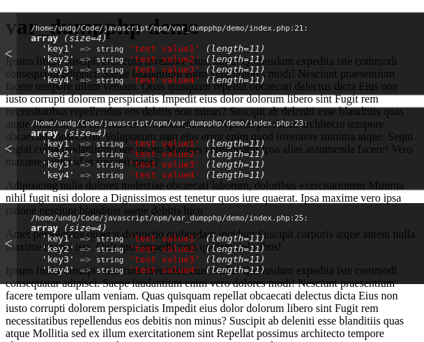

# var_dumpPHP
Javascript extension to style PHP's var_dump with xdebug.

var_dump's are positioned absolute on top of the page. You can hide each of them by clicking on it.


## Instalation

Install it with npm, and include in your source like any node package:
    
`npm install --save var_dump_php`


Or download it and put this directly in html

```javascript
    <script type="module">
      import var_dump from './var_dumpphp.js'
      document.addEventListener('DOMContentLoaded', var_dump)
    </script>
  ```

## Dependencies 
https://xdebug.org
Xdebug is an extension for PHP and have to by installed.
It upgrades PHP's var_dump() function.

## Screenshoot




